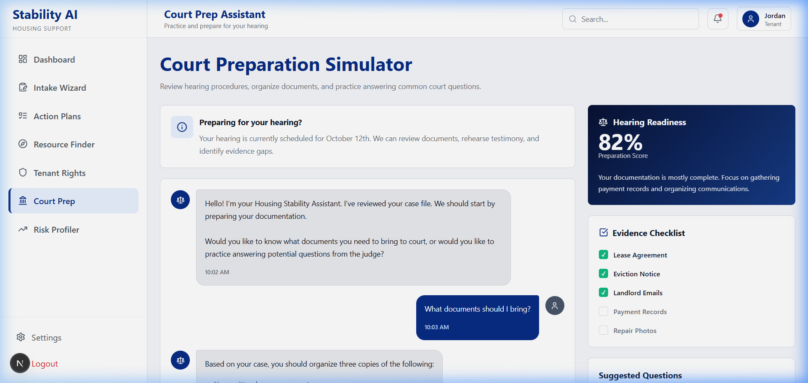
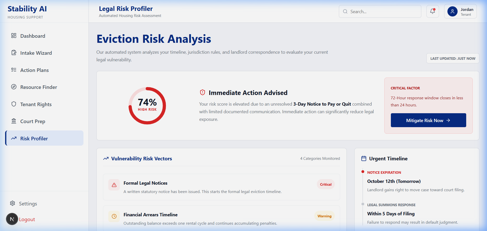

# Stability AI — Housing Stability & Tenant Support Panel

Stability AI is a modern, responsive web application designed to empower tenants facing housing instability, eviction risks, or landlord disputes. The panel provides automated action plans, resource finding tools, court preparation, and tenant rights defense utilities.

---

## 📸 Web Page Gallery

### 1. Dashboard
The central dashboard provides overview stats, recent activity logs, current housing stability score, and quick links to core modules.


### 2. Intake Wizard
An interactive multi-step questionnaire that gathers information about tenant status, lease agreement, and specific housing challenges.


### 3. Action Plans & Document Generators
Enables tenants to view custom action plans and generate formal communications such as Rent Payment Plans, Lease Terminations, and Landlord Letters.


### 4. Resource Finder
Matches tenants with legal help, financial aid, emergency shelters, and food assistance programs.


### 5. Tenant Rights Database
A comprehensive search tool for state/local laws, eviction defense regulations, and habitability standards.


### 6. Court Prep & Hearing Readiness
Provides court hearing preparation, document checklists, timelines, and checklists to ensure preparedness.


### 7. Eviction Risk Profiler
Analyses lease and situation data to output an eviction risk probability score along with preventative suggestions.


---

## 🛠️ Tech Stack & Architecture

- **Framework**: [Next.js](https://nextjs.org/) (App Router)
- **Language**: [TypeScript](https://www.typescriptlang.org/)
- **Styling**: [Tailwind CSS](https://tailwindcss.com/) & Vanilla CSS variables
- **State Management**: React Context / Hooks

---

## 🚀 Getting Started

Follow these steps to set up and run the project locally.

### Prerequisites

Ensure you have **Node.js** (v18.x or higher) installed on your system.

### 1. Fork the Repository
If you want to contribute, start by clicking the **Fork** button at the top-right of the GitHub repository page to create a personal copy under your GitHub account.

### 2. Clone the Repository
Clone the repository to your local machine using the command line:

```bash
git clone https://github.com/tejass06/Stability-AI.git
cd Stability-AI
```

*(If you forked the repository, replace `tejass06` with your GitHub username).*

### 3. Install Dependencies
Run the package manager to install the project dependencies:

```bash
npm install
```

### 4. Run the Development Server
Start the Next.js development server locally:

```bash
npm run dev
```

The application will start running at [http://localhost:3000](http://localhost:3000).

### 5. Build for Production
To build the application for deployment:

```bash
npm run build
npm start
```
